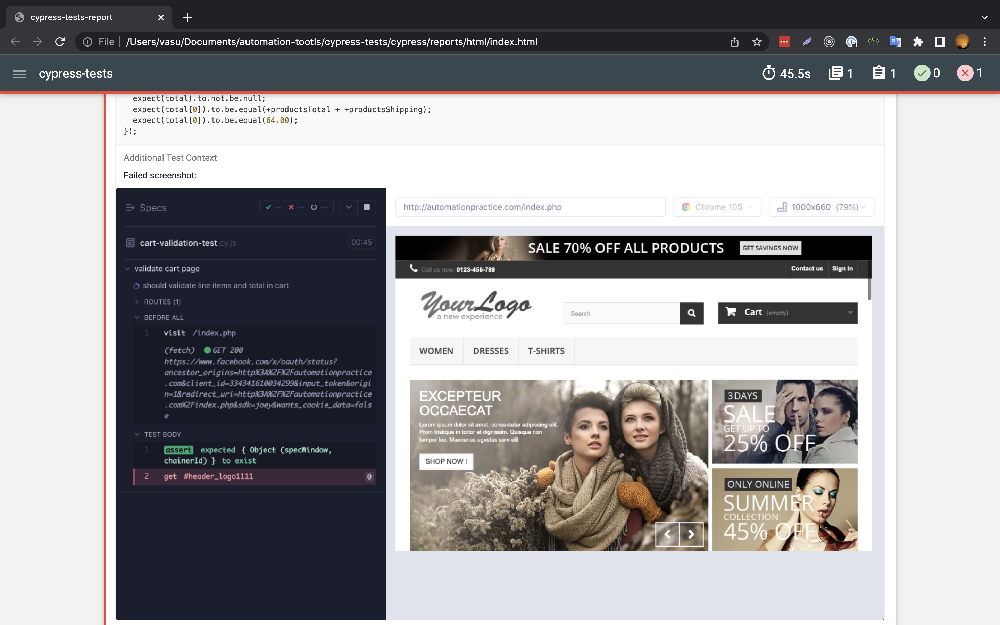
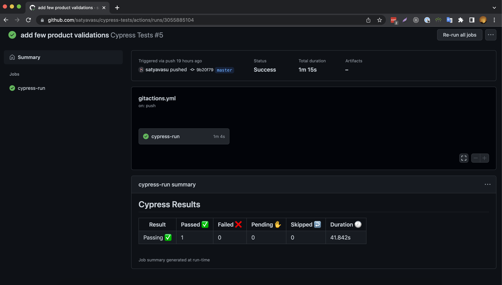

# Global radio technical test(ypress)

An example project using the automation tool, [Cypress](https://www.cypress.io/). These tests are intended to provide examples of common actions you may need in your testing. I've included:
- page objects
- various ways of running the tests (via npm scripts)

## Table of Contents

- [Requires](#Requires)
- [Setup](#Setup)
- [Run the tests](#Run-the-tests)
- [Folder structure](#Folder-structure)
- [Cypress custom commands](#Cypress-custom-commands)
- [Working with XHR](#Working-with-XHR)
- [continue integration](#continue-integration)
- [Contacts](#Contacts)


## Requires
1. Node (download from [here](https://nodejs.org/en/download/))
1. Git (download form [here](https://git-scm.com/downloads))
1. Chrome, Firefox and Edge

## Setup
1. clone git repo: `https://github.com/satyavasu/cypress-tests.git`
1. install dependencies: `npm i`

## Run the tests
1. run all tests with headless: `npm run cy:run`
1. open cypress runner: `npm run cy:open`

## Folder structure
```bash
├── cypress
│   ├── download
|   |── fixtures
│   ├── e2e
│   │  ├── **/*.cy.js
│   ├── reports
│   ├── support
│   │  ├── commands.js
│   │  ├── e2e.js
```
- _**fixures**_: fixtures are used as external pieces of static data that can be used by your tests. Read more [here](https://docs.cypress.io/guides/core-concepts/writing-and-organizing-tests.html#Fixture-Files)

- _**support**_: By default Cypress will automatically include the support file cypress/support/index.js. This file runs before every single spec file.
- _**e2e**_: e2e folder contains the actual tests.
- _**reports**_: By default mochawesome reports will store into report folder.

## Cypress custom commands
This project also adds several custom commands in [cypress/support/commands.js](cypress/support/commands.js). They are useful to reduce the duplicate code.

Example of commands 
```js
    #add Printed Summer Dress product to bag
    cy.clickOnProduct('Printed Summer Dress')

    #select size M
    cy.selectSize('M')

    #add to bag
    cy.addToBag()

    #check number of items in cart
    cy.cartItemCount(3)

```

## Working with XHR

https://docs.cypress.io/guides/guides/network-requests.html

Sample Code -

```js
    cy.intercept('POST', '/index.php?rand=*').as('xhr')
```

- cy.intercept is used to control the behavior of HTTP requests.

  - Default method is GET
  - specify endpoint to be tested
  - Create an alias and use it for subsequent tests

## Reports

- Using mochawesome to get the tests report in html format.




## continue integration (Git actions)
- For this cypress automation tests added git actions to run and get the test results by every git push.



## :email: Contacts
Email: vasureddy1991@gmail.com